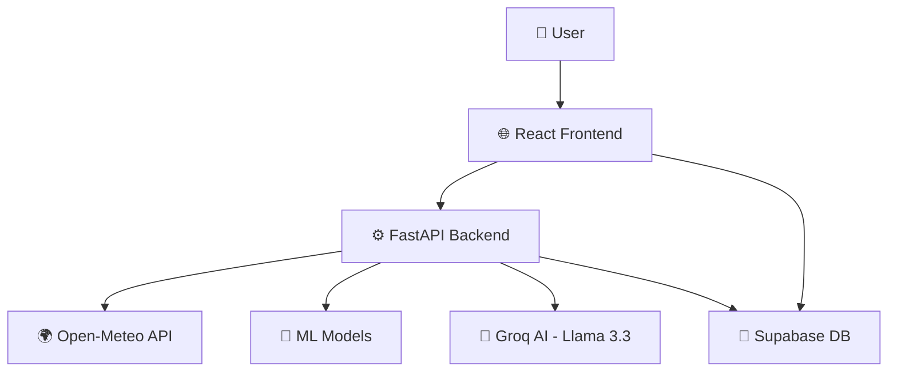
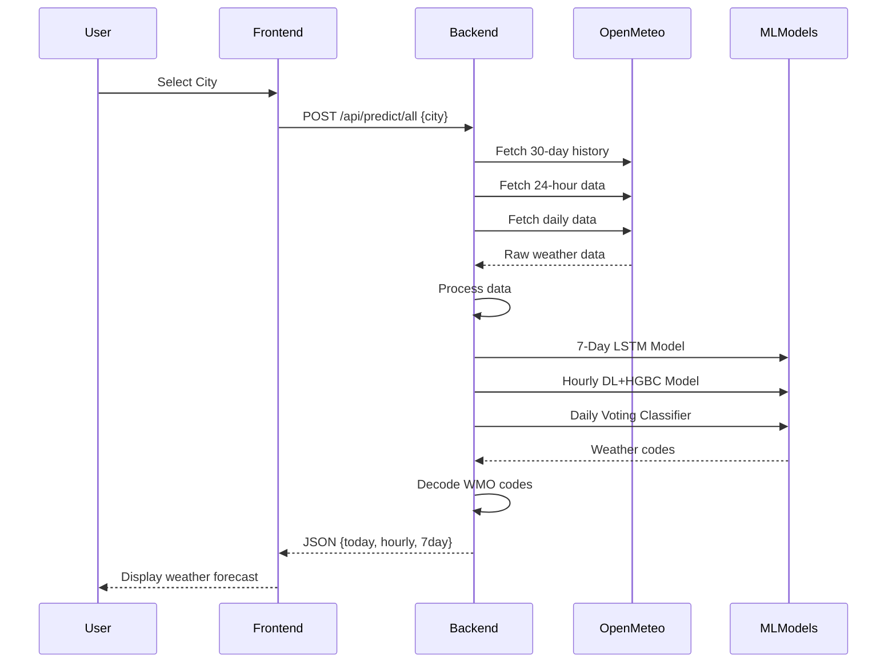
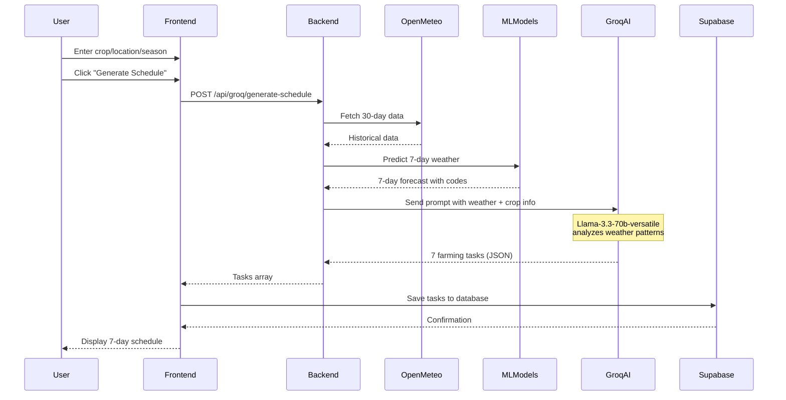

# 🌤️ Weather Forecasting System - Data Flow

Complete flow diagram of the Agri-Weather system, from data collection to AI-powered agriculture planning.

---

## 📊 System Architecture Overview



---

## 🔄 Main Data Flow

### 1️⃣ Weather Prediction Flow



---

### 2️⃣ AI Agriculture Planning Flow



---

## 🔍 Detailed Component Flows

### Weather Data Collection (Backend)

```
┌─────────────────────────────────────────────────────────┐
│                  crawl.py Functions                     │
├─────────────────────────────────────────────────────────┤
│                                                          │
│  1. get_coordinates(city)                               │
│     └─> Returns: {lat, lon}                             │
│                                                          │
│  2. get_weather_data_30(city)                           │
│     └─> Fetches: 30 days history (for 7-day model)     │
│     └─> Returns: Raw JSON with 17 parameters           │
│                                                          │
│  3. get_weather_data_24hour(city)                       │
│     └─> Fetches: Next 24 hours forecast                │
│     └─> Returns: Hourly data (11 parameters)           │
│                                                          │
│  4. get_weather_data_daily(city)                        │
│     └─> Fetches: Today's weather                       │
│     └─> Returns: Daily aggregate (17 parameters)       │
│                                                          │
│  5. process_*_weather_data()                            │
│     └─> Cleans and formats data                        │
│     └─> Returns: Pandas DataFrame                      │
│                                                          │
└─────────────────────────────────────────────────────────┘
```

### ML Prediction Pipeline (Backend)

```
┌─────────────────────────────────────────────────────────┐
│                 predict.py Functions                     │
├─────────────────────────────────────────────────────────┤
│                                                          │
│  1. load_models() - Startup                             │
│     ├─> Load 7-day LSTM model                           │
│     ├─> Load hourly DL + HGBC models                    │
│     └─> Load daily VotingClassifier                     │
│                                                          │
│  2. predict_weather_7days(df_30d)                       │
│     ├─> Input: 30-day sequence                          │
│     ├─> Scale features                                  │
│     ├─> LSTM inference                                  │
│     ├─> Inverse scale                                   │
│     ├─> Add temporal features (sin/cos day of year)     │
│     ├─> Predict weather codes (daily model)             │
│     └─> Output: 7-day forecast DataFrame                │
│                                                          │
│  3. predict_weather_hourly(df_hourly)                   │
│     ├─> Input: Current hourly data                      │
│     ├─> Scale features                                  │
│     ├─> Deep learning prediction                        │
│     ├─> HGBC classification                             │
│     └─> Output: 24 weather codes                        │
│                                                          │
│  4. predict_weather_daily(df_daily)                     │
│     ├─> Input: Today's aggregate data                   │
│     ├─> Add temporal features                           │
│     ├─> Scale features                                  │
│     ├─> VotingClassifier prediction                     │
│     └─> Output: Today's weather code                    │
│                                                          │
│  5. decode_wmo_code_batch(codes)                        │
│     └─> Converts WMO codes to descriptions              │
│                                                          │
└─────────────────────────────────────────────────────────┘
```

### API Endpoints (Backend)

```
┌─────────────────────────────────────────────────────────┐
│              main.py - FastAPI Routes                    │
├─────────────────────────────────────────────────────────┤
│                                                          │
│  Weather Endpoints:                                      │
│  ├─> POST /api/predict/all                              │
│  │   └─> Returns: {today, hourly, 7day} in one call    │
│  │   └─> Optimized: Single API call for all data       │
│  │                                                       │
│  ├─> POST /api/predict/daily                            │
│  │   └─> Returns: Today's weather only                 │
│  │                                                       │
│  ├─> POST /api/predict/hourly                           │
│  │   └─> Returns: 24-hour forecast                     │
│  │                                                       │
│  └─> POST /api/predict/7days                            │
│      └─> Returns: 7-day forecast                       │
│                                                          │
│  AI Endpoints:                                           │
│  ├─> POST /api/groq/generate-schedule                   │
│  │   └─> Input: {crop, location, season, city}         │
│  │   └─> Returns: {tasks: [{day, desc, details}]}      │
│  │                                                       │
│  └─> GET /api/groq/test                                 │
│      └─> Tests Groq API connection                      │
│                                                          │
└─────────────────────────────────────────────────────────┘
```

### Frontend State Management

```
┌─────────────────────────────────────────────────────────┐
│                React Context Providers                   │
├─────────────────────────────────────────────────────────┤
│                                                          │
│  1. AuthContext                                          │
│     └─> Manages: user, login, logout, register          │
│                                                          │
│  2. CityContext                                          │
│     └─> Manages: selectedCity, setSelectedCity          │
│     └─> Default: "Da Nang"                              │
│                                                          │
│  3. WeatherContext                                       │
│     └─> Manages: weatherData, loading, error            │
│     └─> Fetches: /api/predict/all on city change        │
│     └─> Caches: Results to avoid re-fetching            │
│                                                          │
└─────────────────────────────────────────────────────────┘
```

---

## 🎨 Frontend Component Hierarchy

```
App.tsx
├── AuthContext
│   └── CityContext
│       └── WeatherContext
│           ├── Login/Register (if not authenticated)
│           └── Dashboard (if authenticated)
│               ├── CitySearch
│               ├── WeatherTab
│               │   ├── WeatherToday
│               │   ├── HourlyWeather (24h)
│               │   └── SevenDayForecast (7d)
│               ├── AgriculturePlanner
│               │   ├── Plan Form
│               │   ├── AI Generate Button
│               │   └── 7-Day Calendar
│               └── FloatingChatButton
│                   └── ChatPanel
```

---

## 🤖 AI Task Generation Details

### Groq AI Prompt Structure

```
┌─────────────────────────────────────────────────────────┐
│           Groq AI Prompt Engineering                     │
├─────────────────────────────────────────────────────────┤
│                                                          │
│  System Role:                                            │
│  "You are an expert agricultural advisor..."            │
│                                                          │
│  Input Context:                                          │
│  ├─> Crop: e.g., "Rice"                                 │
│  ├─> Location: e.g., "North Field, Da Nang"            │
│  ├─> Season: e.g., "Summer 2025"                        │
│  ├─> Notes: User's additional info                      │
│  └─> Weather Forecast:                                  │
│      ├─> Day 0: {temp, rain, humidity, wind, weather}   │
│      ├─> Day 1: {...}                                   │
│      └─> ... (7 days total)                             │
│                                                          │
│  Instructions:                                           │
│  ├─> Create EXACTLY 7 tasks (day 0-6)                   │
│  ├─> Consider weather conditions for each day           │
│  ├─> Tasks should be practical for the crop             │
│  ├─> Include preventive measures for bad weather        │
│  └─> Format: JSON only                                  │
│                                                          │
│  Model: llama-3.3-70b-versatile                         │
│  Temperature: 0.7 (balanced creativity)                  │
│  Max tokens: 2000                                        │
│                                                          │
└─────────────────────────────────────────────────────────┘
```

### Example AI Analysis

```
Input Weather:
├─> Day 0: Clear, 28°C, 0mm rain, 70% humidity
├─> Day 1: Partly cloudy, 27°C, 0mm, 75%
├─> Day 2: Light rain, 25°C, 5mm, 85%
├─> Day 3: Heavy rain, 24°C, 15mm, 90%
└─> ...

AI Output Tasks:
├─> Day 0: "Prepare soil" - Clear weather ideal
├─> Day 1: "Plant seedlings" - Good temperature
├─> Day 2: "Apply fertilizer" - Before rain
├─> Day 3: "Check drainage" - Heavy rain expected
└─> ...
```

---

## 🗄️ Database Schema

```
┌─────────────────────────────────────────────────────────┐
│                  Supabase Tables                         │
├─────────────────────────────────────────────────────────┤
│                                                          │
│  users                                                   │
│  ├─> id (UUID, PK)                                      │
│  ├─> email                                              │
│  ├─> created_at                                         │
│  └─> ...                                                │
│                                                          │
│  agriculture_plans                                       │
│  ├─> id (UUID, PK)                                      │
│  ├─> user_id (FK → users)                               │
│  ├─> crop_name                                          │
│  ├─> farm_location                                      │
│  ├─> season_goal                                        │
│  ├─> notes                                              │
│  └─> created_at                                         │
│                                                          │
│  daily_tasks                                             │
│  ├─> id (UUID, PK)                                      │
│  ├─> plan_id (FK → agriculture_plans)                   │
│  ├─> task_date (INT: 0-6)                               │
│  ├─> task_description                                   │
│  ├─> task_details                                       │
│  ├─> is_completed (BOOLEAN)                             │
│  └─> created_at                                         │
│                                                          │
│  chat_messages                                           │
│  ├─> id (UUID, PK)                                      │
│  ├─> user_id (FK → users)                               │
│  ├─> message                                            │
│  ├─> is_user (BOOLEAN)                                  │
│  └─> created_at                                         │
│                                                          │
└─────────────────────────────────────────────────────────┘
```

---

## 📈 Data Processing Pipeline

### Step-by-Step: From API Call to UI Display

```
1. User clicks "Da Nang" city
   ↓
2. CityContext updates selectedCity
   ↓
3. WeatherContext detects change
   ↓
4. Frontend calls: weatherApi.predictAll("Da Nang")
   ↓
5. Backend endpoint: POST /api/predict/all
   ↓
6. Backend parallel operations:
   ├─> Crawl 30-day data → Process → 7-day prediction
   ├─> Crawl 24-hour data → Process → Hourly prediction
   └─> Crawl daily data → Process → Today prediction
   ↓
7. ML Models inference:
   ├─> LSTM (7-day): Input 30 days → Output 7 days × 17 params
   ├─> DL+HGBC (hourly): Input 24 rows → Output 24 weather codes
   └─> VotingClassifier (daily): Input 1 row → Output 1 weather code
   ↓
8. Backend decodes weather codes → Human-readable descriptions
   ↓
9. Backend returns JSON:
   {
     today_forecast: {...},
     hourly_forecast: [{...}, ...],  // 24 items
     seven_day_forecast: [{...}, ...]  // 7 items
   }
   ↓
10. Frontend receives data
   ↓
11. WeatherContext updates weatherData state
   ↓
12. Components re-render:
    ├─> WeatherToday displays current conditions
    ├─> HourlyWeather shows 24h chart + precipitation
    └─> SevenDayForecast shows 7-day cards with icons
   ↓
13. User sees weather forecast ✅
```

---

## 🔐 Security & Authentication Flow

```
1. User enters credentials
   ↓
2. Frontend → Supabase Auth
   ↓
3. Supabase validates
   ↓
4. Returns JWT token
   ↓
5. Frontend stores in AuthContext
   ↓
6. All subsequent requests include token
   ↓
7. Supabase RLS (Row Level Security) enforces:
   - Users can only see their own plans
   - Users can only modify their own tasks
```

---

## 🚀 Performance Optimizations

### 1. Single API Call Strategy
- ✅ Call `/api/predict/all` once instead of 3 separate calls
- ✅ Reduces latency from ~15s to ~5s
- ✅ Cached in WeatherContext to prevent re-fetching on tab switch

### 2. Model Loading
- ✅ All models loaded on server startup (`@app.on_event("startup")`)
- ✅ No loading delay during predictions

### 3. Data Caching
- ✅ Frontend caches weather data per city
- ✅ Backend can add Redis cache for API responses (future)

---

## 🌟 Key Features Summary

| Feature | Technology | Description |
|---------|-----------|-------------|
| **Weather Forecasting** | TensorFlow + scikit-learn | 3 ML models for different time ranges |
| **AI Planning** | Groq + Llama 3.3 | Weather-aware farming schedules |
| **Real-time Data** | Open-Meteo API | Up-to-date weather information |
| **Authentication** | Supabase Auth | Secure user management |
| **Database** | Supabase PostgreSQL | Plans and tasks storage |
| **UI/UX** | React + Tailwind | Responsive, modern interface |
| **Charts** | Recharts | Temperature trends, precipitation |
| **Icons** | Lucide React | Weather condition visuals |

---

## 📝 WMO Weather Codes Reference

```
Code  Description
────  ────────────────────────────────
0     Clear sky
1-2   Mainly clear, partly cloudy
3     Overcast
45-48 Fog
51-55 Drizzle (light to heavy)
61-65 Rain (slight to heavy)
71-75 Snow fall
80-82 Rain showers
95    Thunderstorm
96-99 Thunderstorm with hail
```

---

## 🔄 Typical User Journey

```
1. Landing → Login/Register
2. Dashboard → Select city (e.g., "Hanoi")
3. View Weather:
   ├─> Today: 28°C, Partly cloudy
   ├─> Hourly: Temperature trend chart
   └─> 7-Day: Week forecast cards
4. Switch to Agriculture tab
5. Create Plan:
   ├─> Crop: "Tomato"
   ├─> Location: "Greenhouse 2"
   └─> Season: "Winter 2025"
6. Click "Generate with AI"
7. Wait ~8 seconds...
8. AI creates 7 tasks based on weather
9. View/Edit tasks in calendar
10. Mark tasks as completed
11. Check chat for support
```

---

**End of Flow Documentation** 🎯

For implementation details, see source code in `src/` directory.

